# Apoyo a la formación 🎓

Aquí podrás encontrar los ejemplos y ejercicios de los cursos. Dispones de una extensa colección de más de 200 repositorios, centrados principalmente en la formación y desarrollo de software, que abarcan desde fundamentos de programación hasta prácticas avanzadas en desarrollo web, backend, DevOps, pruebas y calidad.

## Proyectos funcionales ⚒

 

## Estadisticas 📈

 

<!--
**jmagit/jmagit** is a ✨ _special_ ✨ repository because its `README.md` (this file) appears on your GitHub profile.

Here are some ideas to get you started:

- 🔭 I’m currently working on ...
- 🌱 I’m currently learning ...
- 👯 I’m looking to collaborate on ...
- 🤔 I’m looking for help with ...
- 💬 Ask me about ...
- 📫 How to reach me: ...
- 😄 Pronouns: ...
- ⚡ Fun fact: ...
-->
